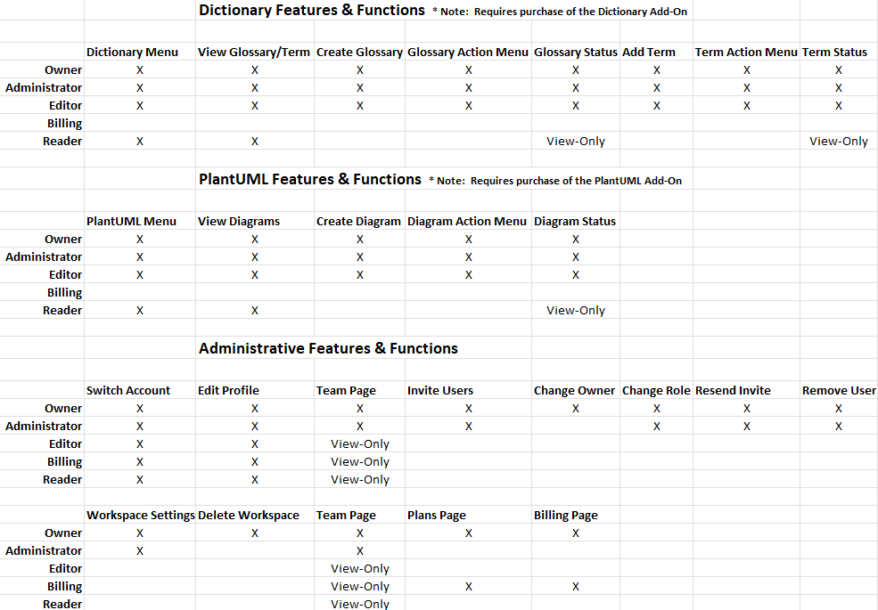

# Team

**Invite Users**

Follow these steps to invite more team members to your workspace:

Step 1:  Choose _Team_

Select the top right navigation menu (avatar), then select _Team_.

Step 2:  Enter Email Address

Enter the email address of the user to invite.  Then choose the appropriate Role.  See below for the full list of permissions of roles.

Step 3:  Add More

Should you need to invite more than one user, select the _+Add More_ option, then enter the email address and choose the role.  Repeat as necessary.

Step 4:  Invite

Now select the _Invite_ button. An email will be generated and sent to the email address(s) specified. Upon receipt, the user can accept the invitation via the link within the email.

Step 5:  User Accepts Invitation

After selecting the link in the invitation email, the user will be navigated to the registration / sign-in form.  If they are a new user to the system, they will select Sign Up, otherwise if they are already a user (perhaps as a member of another workspace) then they can just sign in with their existing credentials.

Step 6:  Email Address Verification (new users only)

After registration and acceptance of the invitation, an email will be generated and sent to the email address specified whereby the user can verify their email address. Once the user selects the link within the email, they can navigate back to the application where they can then log in using the credentials specified in Step 5.

**Team Members tab**

You can utilize the Team Members tab (Owners/Administrators/Editors only) to manage team members of your workspace, ie:

* Modify a users role (using the dropdown net to each member)
* Remove a user from the workspace (select the "..." menu on the right and then select _Remove User_).

**Pending tab**

The Pending tab contains all users that have a pending invitation (have not accepted yet).  To resend an invitation to the user, select the "..." menu on the right and then select _Resend Invite_. To remove a user from the pending list, select the "..." menu on the right and then select _Remove User_.

Owners and Administrators can also change the role of an existing user.  However, only the Owner of the workspace can make another user the Owner (and when doing so the previous Owner will become an Administrator).   To change the role of a user, simply select the new role from the dropdown list and it will be saved.  The following roles are available:

* Owner -  the user that originally created the workspace. Has access to all functions.
* Administrator - has access to most of the functions an Owner does
* Editor - can edit content but does not have access to the administrative functions
* Billing - has access to the Plans and Billing page
* Reader - has access to most functions but cannot edit content (read-only)

The following grid displays the features/functions in the system and which roles have access to them:

**Requested tab**

The Requested tab contains all users that have signed up with an email address domain that matches your workspace, without an invitation.  On the Workspace Settings -> Joining page, you can configure if you want these users to automatically join your workspace upon sign-up, or, require the Owner to approve them.  If the latter is configured, to approve a user, select the "..." menu on the right and then select _Approve_.  To deny & remove the requested user, select the "..." menu on the right and then select Deny.
