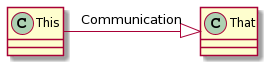

# Introduction to PlantUML

### Introduction to PlantUML 

This section introduces readers to the basics of PlantUML, explaining what it is, how it works, and why it’s useful for regulatory diagramming.

#### What is UML? 

The abbreviation UML stands for “Unified Modeling Language.” It is a standardized form of visual language that is utilized in the process of designing and documenting software systems. The Unified Modeling Language (UML) comprises a collection of diagrams representing a distinct aspect of a system, such as the system’s structure, behavior, or interactions.

#### What is PlantUML? 

A text-based syntax can be used to create diagrams with the help of PlantUML, a program that is both open-source and free to use. PlantUML enables users to create diagrams by describing the components of the diagram using straightforward language, as opposed to the traditional method of requiring users to “drag and drop” symbols and connectors onto a canvas. In short, a user enters text in a text field in the application and the PlantUML server processes that text and either returns an error or a diagram as shown below.

How PlantUML works

As we said above, it makes it possible for users and computers to generate various diagrams using a straightforward syntax. Although PlantUML can be used for multiple purposes, regulatory diagramming is one area in which it is beneficial. In this area, it is essential to demonstrate compliance with regulatory requirements by producing clear and accurate diagrams that can be read or edited like text. PlantUML is _particularly_ useful in this area.

**Where can I access PlantUML?**

The leading site for PlantUML is the PlantUML.com website, which is a free-to-use PlantUML site. However, the PlantText.com website (also free) and the UCF’s PlantUML instance are integrated with our other sites (accessible at apps.unifiedcompliance.com).

#### The Basics of Regulatory Diagramming using PlantUML

This chapter provides an overview of the types of diagrams typically required for regulatory compliance, such as process flow diagrams, data flow diagrams, and organizational charts.

Regulatory compliance often requires the creation of a wide range of diagrams to document processes, data flows, and organizational structures. Some of the most common types of diagrams used for regulatory compliance include:

*
  * **Process flow diagrams** show the steps in a particular process and how those steps are connected. Process flow diagrams can document simple and complex processes and are often used in regulatory compliance to establish procedures and workflows.
  * **Data flow diagrams** show how data moves through a system or organization and how it is transformed or processed. Data flow diagrams can document data storage and retrieval processes, data exchange processes between different systems, and data processing workflows.
  * **Organizational charts** show the structure of an organization, including the roles and responsibilities of different employees or departments. Organizational charts can be used to document reporting structures, decision-making processes, and the allocation of resources within an organization.

So why not diagrams as code? What if you could use text and a few snippets of formatting around that text to turn that text into various forms of diagramming? What if we wanted to visualize something as simple as

This communicates with That

To visualize this in PlantUML, you simply need a few pointers and the type of diagram you want to draw.

**Activity diagrams**

An Activity diagram is a flowchart representing the flow from one activity to another.

@startuml

:This;

:That;

@enduml

Activity diagram

Everything begins and ends with @xxxuml. There isn’t much difference in the text of what is added, only the formatting. The following sequence diagram adds the communication text and slightly reformat how This and That are written.

**Sequence diagrams**

Sequence or event diagrams illustrate how messages flow through a system. It enables the visualization of several dynamic scenarios. A sequential sequence of events occurs between two lifelines, meaning both lifelines are present at the same time. According to UML, an upper and lower lifeline and a message flow are represented by three vertical dotted lines at the bottom of the page.

@startuml

This -> That : Communication

@enduml

Sequence diagram

Again, we simply reformat how This and That are written for the Use Case diagram.

**Use Case diagram**

The use case diagram illustrates how the system’s users interact with it. An application, system, or process that interacts with people, organizations, or external systems may benefit from developing a use case diagram.

@startuml

:This: -> :That: : Communication

@enduml

Use Case diagram

You should get the idea. Here are several other methods that can be used:

**Class diagram**

The class diagram enables the conceptualization of application structure and the implementation of details in programming code. It is also possible to use class diagrams for data modeling.

@startuml

This -|> That: Communication

@enduml

Class diagram

**Component diagram**

Component diagrams represent the different parts of a UML diagram. In contrast to describing the system’s functionality, it means the components used to achieve it.

@startuml

\[This] -> \[That]: Communication

@enduml

Component diagram

**Deployment diagram**

Deployment diagrams are structure diagrams used in modeling an object-oriented system's physical aspects. They are often used to model the static deployment view of a system (topology of the hardware).

@startuml

folder This

file That

This -> That: Communication

@enduml

Deployment diagram

Other slightly different formats can be used as well.

**Work Breakdown Structure**

A work breakdown structure defines everything a project needs to accomplish, organized into multiple levels and displayed graphically.

@startwbs

\+ This

\++ That

\+++ A sub-task

\++ Some other Thing

@endwbs

WBS diagram

As you can see, PlantUML allows users to specify various diagrams in a simple text format similar to programming languages. It is the most popular text format for diagramming. As we showed above, it supports many different diagram types, separates each element according to its function, and uses a simple, human-readable language.
