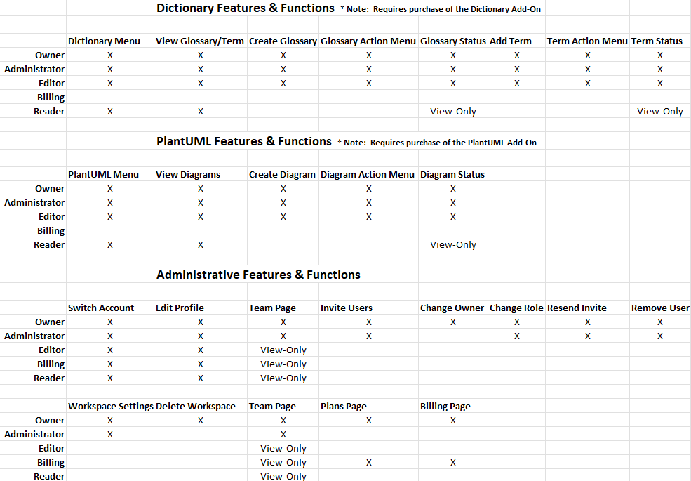

# Dictionary

The Dictionary module allows you to look up a term against several different dictionary providers, including, the Unified Compliance Dictionary.  We have integrated with the following third party Dictionary providers:  Merriam-Webster, Oxford, Cambridge, Wordnik, and Free.&#x20;

Enter a term and press _Search_ and the system will query all 6 dictionaries (unless filtered to a smaller list) and display a consolidated list of results grouped by the part-of-speech for the term and then by dictionary provider.  There are 10 possible part-of-speech categories:  Noun, Verb, Pronoun, Adjective, Adverb, Preposition, Conjunction, Interjection, Undefined, and Other.

By default (unless a pre-filter on Dictionary provider was set), the system will return the results found for all Dictionary providers and applicable parts of speech:

.png>)

None of the checkboxes are checked meaning the results apply to all of them.  Filter the results by checking one or more of the checkboxes.  For example, selecting Nouns and Verbs as the parts of speech, and, Unified Compliance and Merriam-Webster as the dictionaries will result in:

.png>)

To see the results for a particular part-of-speech and dictionary, select the drop-down accordion of the part-of-speech first followed by the drop-down accordion of the dictionary:

.png>)

Here you will see the possible definitions for the selected part-of-speech.

To clear all selections / filters, choose the _Clear Filters_ option here:

.png>)

To perform a new search for another term, choose _Clear Search_ (or simply enter a new term and press _Search_):

Further, you can create Glossaries and add terms you search for to an applicable Glossary.  Select _Glossaries_ from the left side navigation and then choose _Create Glossary_.  Give the glossary a name, description, and select the checkbox (if desired) to make the glossary visible to the community.  Then select _Add_.  The glossary will then appear in the list of glossaries for the account, where you can use the right hand side Action menu to perform actions on a glossary (such as Publish, Rename, Edit, Duplicate and Delete).  Simply click on a glossary in the list to manage the contents of it. &#x20;

Once one or more glossaries are created, you can add Terms to them directly from the search screen as seen here:

.png>)

Simply select the _Add_ button next to the Term & Definition pair that you would like to add to a Glossary.  The term, part-of-speech, and definition will be pre-populated - simply select the Glossary to add to from the drop down list and then select _Add:_

.png>)

There is no limit to the number of terms/definitions that can be added to a Glossary.
